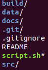

# EMBEDDED LINUX : 3rd year Highschool lesson

## Introduction

This whole repository contains the work done during my lessons of Embedded Linux in my 3rd year in IG2I.
The cours was divided in two modules :
- booting a Linux from a USB device on your computer
- booting a Raspian from a SD card/USB on a RPI

## Disclaimer

I do my best to write the comments and variable's name in English but, as a french-native learning in a French school, it is possible that some parts, may be most, are in french.
The whole odt file in docs/ is in french because it was my notes during the cours and partical exercices.

This whole project is delivered without any warranty of well functioning.
I'm a 3rd year student, not an System Engineer.
The whole sources may be based on old technologies which are not recommanded anymore for a effective product.

If you have any question, I would be pleased to answer you but I'm conviced that internet will help you better than I will.

## Important informations to use this project

The project structre is base as follow :



Because of the size of the sources and build folder, I couldn't push them into git.
That's why I suggest you to download a [Linux kernel](https://www.kernel.org/) as tar.xz archive and [Busybox](https://busybox.net/) as tar.bz2.
After that rename them as, respectively, linux_kernel.tar.xz and busybox.tar.bz2.
If you want to change the format of archive you'll have to change the untar command in the script which are :

```sh
# For the Linux kernel at line 101 of script.sh
tar -Jxvf linux_kernel.tar.xz --directory=../build --one-top-level=linux_kernel --strip-components=1

# For Busybox at line 197 of script.sh
tar -jxvf busybox.tar.bz2 --directory=../build --one-top-level=busybox --strip-components=1
```

You can also change the default device define in the script in order to use it faster.

```sh
# At line 18
DEVICE="/dev/sdc"
```

## Links

If you want to see more of my work and know a bit more about me, check out my [Github Profile](https://github.com/Lafie-rage)
